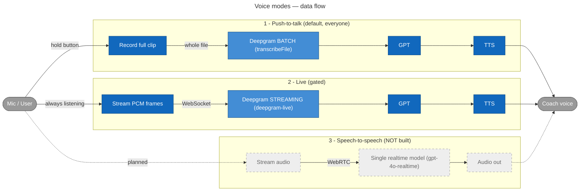

# Voice modes — push-to-talk vs live vs speech-to-speech

**Last updated:** 2026-06-06
**Source of truth for the enum:** `apps/mobile/src/features/practice/voice-mode.ts`

The app declares **three** voice modes (`VoiceMode = "push_to_talk" | "live" | "speech_to_speech"`).
Two are built; one is a placeholder. This doc exists because "live" and "speech-to-speech" are easy
to confuse — they are **not** the same thing.

## Data flow



> Legend — blue = our code, mid-blue = Deepgram, grey = user, dashed grey = not built yet.

## The three modes at a glance

| Mode                 | Capture                                                   | STT                                        | Deepgram?           | Status                             |
| -------------------- | --------------------------------------------------------- | ------------------------------------------ | ------------------- | ---------------------------------- |
| **Push-to-talk**     | Hold button → record a clip → release → send whole file   | Batch (full file)                          | ✅ `transcribeFile` | ✅ Default, works                  |
| **Live**             | Always listening → PCM frames over WebSocket in real time | **Streaming**                              | ✅ `deepgram-live`  | 🔧 Built, gated, under debug       |
| **Speech-to-speech** | (nothing — placeholder)                                   | none (a single realtime model would do it) | ❌ no Deepgram      | ❌ **Not built** — enum entry only |

## Key distinctions (the part that's easy to confuse)

- **Only Live mode uses Deepgram _streaming_ STT.** Push-to-talk also uses Deepgram, but in **batch**
  (file) mode — it sends a finished recording, not a live stream.
- **Live ≠ speech-to-speech.** Both feel "real time", but:
  - **Live** is a _cascade_: Deepgram (STT) → GPT → TTS — three bricks streamed over a WebSocket.
  - **Speech-to-speech** would be a _single_ realtime model (e.g. `gpt-4o-realtime`) over WebRTC that
    ingests audio and emits audio directly — **no Deepgram, no separate TTS**.
- **Speech-to-speech is not implemented.** `speech_to_speech` appears only in the `VoiceMode` enum;
  there is no transport, route, or handler for it. It's the "Horizon 2 realtime" target in the latency
  plan, to be built later in WebRTC.

## Where each mode lives in the code

- **Mode selection / persistence:** `apps/mobile/src/features/practice/voice-mode.ts`
- **Entitlement gating (which accounts get live/s2s):** `apps/api/src/lib/voice-entitlement.ts`,
  `apps/api/src/routes/voice-modes.ts`
- **Push-to-talk STT (batch):** `apps/api/src/providers/deepgram.ts` (`transcribeAudio` →
  `listen.v1.media.transcribeFile`), used by `apps/api/src/routes/voice.ts`
- **Live STT (streaming):** `apps/api/src/providers/deepgram-live.ts`,
  `apps/api/src/routes/voice-live.ts` (WebSocket), client side
  `apps/mobile/src/lib/live-socket.ts` + `apps/mobile/src/features/practice/use-live-conversation.ts`
- **Shared turn (GPT + TTS), used by both push and live:** `apps/api/src/routes/run-turn.ts`
- **Speech-to-speech:** _not implemented._

## Re-rendering the diagram

The standalone source is `docs/architecture/voice-modes-dataflow.mmd`. GitHub renders the embedded
Mermaid above natively — no build step needed. To export an SVG:

```bash
npx -y @mermaid-js/mermaid-cli -i docs/architecture/voice-modes-dataflow.mmd \
  -o docs/architecture/rendered/voice-modes-dataflow.svg --backgroundColor white
```
